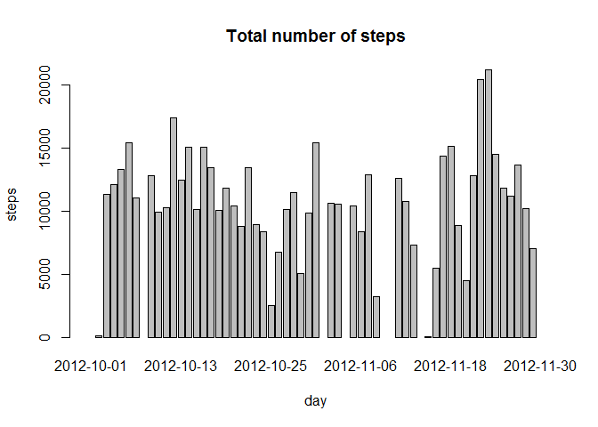
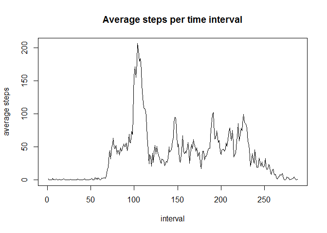
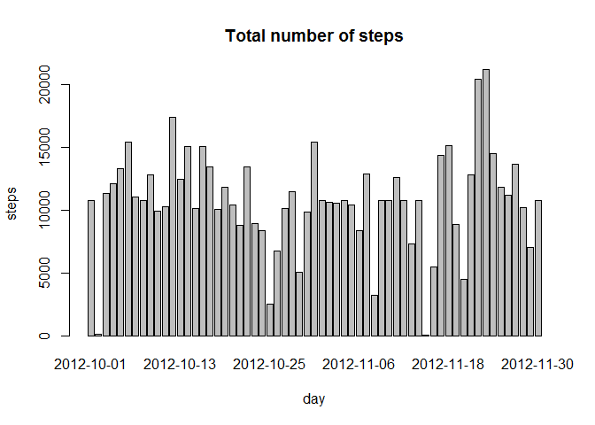
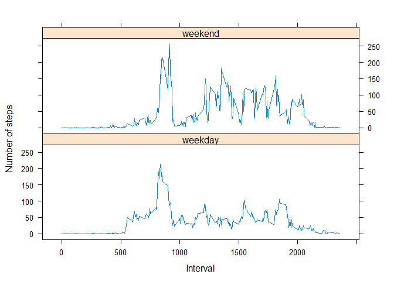

# Reproducible Research: Peer Assessment 1
This is the First Assignment for the course **Reproducible Research** 

##First Loading and Processing the data


```r
activity <- read.csv("activity.csv")
activity$date <- as.Date(activity$date)
```

##Second What is mean total steps taken per day?

1- Calculate the total number of steps taken per day

2- Make a histogram of the total number of steps taken each day

3- Calculate and report the mean and median of the total number of steps taken per day


```r
steps_total <- tapply(activity$steps, activity$date, sum)
barplot(steps_total, main="Total number of steps", xlab="day", ylab="steps")
```

 

```r
mean(steps_total, na.rm=TRUE)
```

```
## [1] 10766.19
```

```r
median(steps_total, na.rm=TRUE)
```

```
## [1] 10765
```

##Third What is the average daily activity pattern?

1- Make a time series plot (i.e. type = "l") of the 5-minute interval (x-axis) and the average number of steps taken, averaged across all days (y-axis)

2- Which 5-minute interval, on average across all the days in the dataset, contains the maximum number of steps?


```r
steps_per_interval <- tapply(activity$steps, activity$interval, mean, na.rm=TRUE)
plot(steps_per_interval, main="Average steps per time interval", xlab="interval", ylab="average steps", type="l")
```

 

```r
steps_per_interval[which.max(steps_per_interval)]
```

```
##      835 
## 206.1698
```

## Fourth Imputing missing values

1- Calculate and report the total number of missing values in the dataset (i.e. the total number of rows with NAs)

2- Create a new dataset that is equal to the original dataset but with the missing data filled in.


```r
sum(is.na(activity$steps))
```

```
## [1] 2304
```

```r
for (i in 1:nrow(activity)){
  activity$steps[i] <- ifelse(is.na(activity$steps[i]), steps_per_interval[row.names(steps_per_interval)==activity$interval[i]], activity$steps[i])
}

steps_total <- tapply(activity$steps, activity$date, sum)
barplot(steps_total, main="Total number of steps", xlab="day", ylab="steps")
```

 

```r
mean(steps_total)
```

```
## [1] 10766.19
```

```r
median(steps_total)
```

```
## [1] 10766.19
```

By replacing the NA value by the mean of this time interval we find that the mean remain unchanged while the median has a minor change and it became exactly like the mean


# Fifth Are there differences in activity patterns between weekdays and weekends?

1- Create a new factor variable in the dataset with two levels -- "weekday" and "weekend" indicating whether a given date is a weekday or weekend day.

2- Make a panel plot containing a time series plot (i.e. type = "l") of the 5-minute interval (x-axis) and the average number of steps taken, averaged across all weekday days or weekend days (y-axis).


```r
activity$weekday <- ifelse(weekdays(activity$date)=="Saturday"|weekdays(activity$date)=="Saturday", "weekend", "weekday")
activity$weekday <- factor(activity$weekday)

test <- aggregate(activity$steps, list(activity$interval, activity$weekday), mean)
library(lattice)
xyplot(x~Group.1|Group.2, data=test, xlab="Interval", ylab="Number of steps", layout=c(1,2), type= "l" )
```

 
